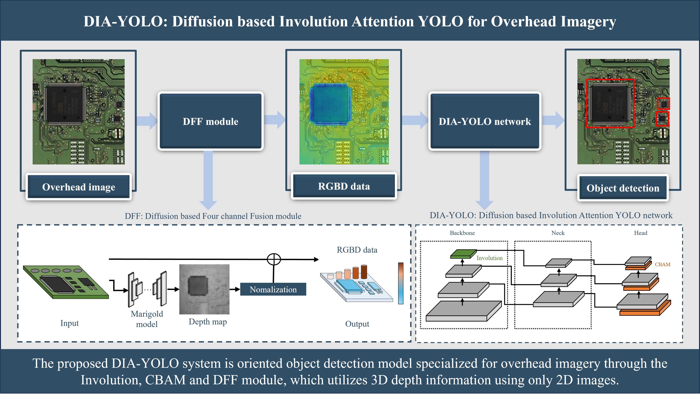
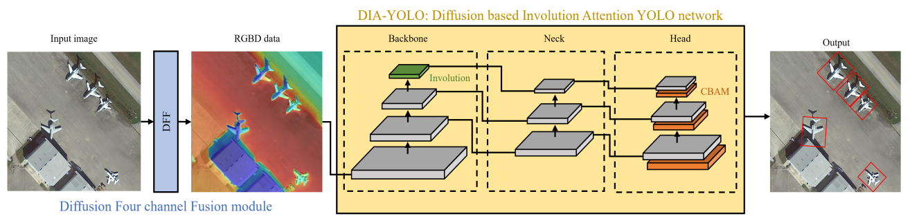
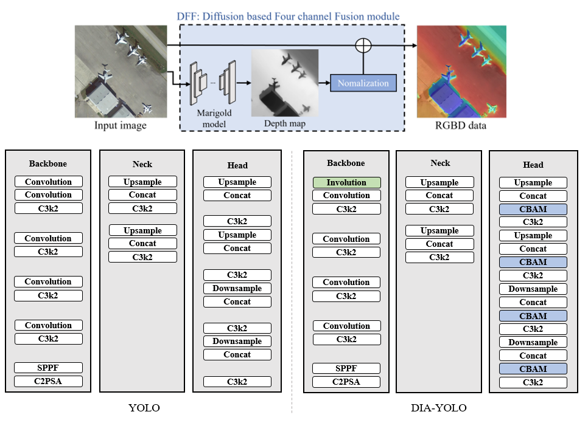
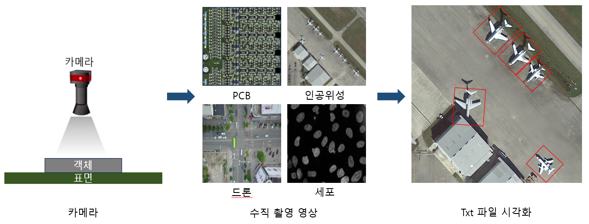
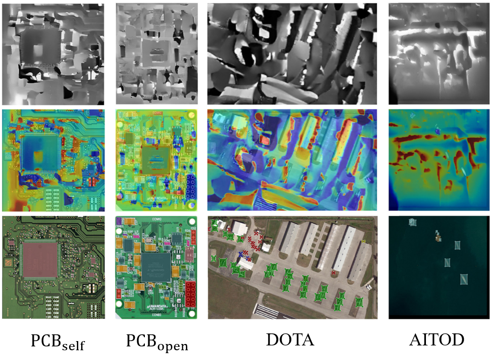

# DIA-YOLO: Diffusion-Based Involution Attention YOLO for Overhead Imagery
[IEEE Xplore](https://ieeexplore.ieee.org/abstract/document/11142761) |[IEEE ACCES 2025 paper](https://ieeexplore.ieee.org/stamp/stamp.jsp?tp=&arnumber=11142761)| [BibTex](#jump1)

-----------
## 요약
<!-- 2. 그림자/둥근 모서리 CSS 적용 -->
<div align="center">
  
</div>

<details>
 <summary> 2D 수직 촬영 영상의 고속·정밀 객체 검출을 위해 특화된 생성형 기반의 모델 설계 </summary>

- 수직 촬영 영상(Overhead Imagery)이란 촬영되는 카메라와 표면 위의 객체가 직각이 되도록하여 촬영된 영상입니다. 수직 촬영 영상의 예시로는 인쇄회로기판(PCB, Printed Circuit Board), 인공위성, 드론, 세포 등의 영상들이 존재합니다. 

- 수직 촬영 영상 중 인공위성, PCB의 공통적인 특징은 초소형(수십 픽셀)의 객체부터 대형 객체까지 혼재하고, 한 영상 속 객체들이 다수 밀집하게 분포하여 있습니다. 이러한 특징은 객체 검출을 어렵게 합니다.

- 따라서 기존의 수직 촬영 영상의 특징을 강화하는 디퓨전 기반 채널 융합 모듈을 제안하고, 강화된 RGBD 4채널 데이터를 입력으로 재구성된 DIA-YOLO(Diffusion-based Involution Attention YOLO)모델을 통해 검출의 성능과 속도를 획기적으로 향상시킵니다.

- 최종적으로 2D 수직 촬영 영상에 대한 정밀한 실시간 객체 검출을 진행하여 PCB 불량 검사, 재난 모니터링 등의 어플리케이션에 활용할 수 있습니다.

</details>

-------------

## 제안 방식

#### 모델 구조

<details>
 <summary> 채널 융합 모듈과 모델로 이어지는 구조로 영상의 특징을 강화하고 이를 고려하여 설계된 네트워크를 통한 고속·정밀 객체 검출까지의 과정 </summary>

- 채널 융합 모듈에서는 디퓨전 기반 Marigold 모델을 통해 추정한 깊이 맵을 활용합니다. 깊이 맵 D와 RGB 영상 간의 채널 축 융합을 통해 4채널의 RGBD 데이터를 생성합니다.

- 네트워크에서는 Involution, CBAM(Convolution Block Attention Module)을 적용하여 깊이 정보를 고려한 수직 촬영 영상에 특화된 객체 검출을 진행합니다.

- 최종적으로 검출된 결과를 영상에 바운딩 박스 형태로 시각화여 다양한 실시간 어플리케이션에 활용합니다.

</details>

<div align="center">
  
</div>

#### 세부 구조

<details>
 <summary> DFF(Diffusion-based Four-channel Fusion) 모듈  </summary>

- DFF 채널 융합 모듈에서는 디퓨전 기반의 Marigold 모델의 추론 기능만을 활용하여 2D 영상에서 1D 깊이 맵을 추정합니다.

- 이후 추정된 깊이 맵을 RGB 영상과 동일한 값의 범위(0 ~ 255)로 정규화를 진행합니다.

- 정규화된 깊이 맵 D와 RGB 영상과의 채널 축 합성을 진행하여 4채널의 RGBD 데이터를 취득합니다.
  
 <summary> Involution </summary>

- 기존 YOLO ver.11의 backbone에서 입력단의 Convolution을 Involution으로 대체합니다.

- Involution에서는 동적 커널을 통해 RGBD 데이터의 깊이 정보를 고려하여 위치별로 다른 커널 값을 적용하여 특징을 추출합니다.

 <summary> CBAM </summary>

- 기존 YOLO ver.11의 head에서 각 레이어 사이에 CBAM을 적용합니다.

- CBAM에서는 채널, 공간 주의(Channel, Spatial attention) 특징 맵을 통해 RGBD 데이터 속 깊이 정보를 풍부하게 활용합니다.

- 더불어 수직 촬영 영상의 특징인 초소형부터 대형 객체들이 밀집한 상태에서 어느 부분에 집중하여 검출을 진행할지 결정함으로써 검출 성능을 향상시킵니다.

</details>

<div align="center">
  
</div>


-------------

## 데이터셋

<details>
 <summary> 카메라를 통해 표면과 수직이 되어 좌측과 같이 데이터 촬영, 객체 정보는 txt 형태로 취득하여 우측과 같이 시각화 </summary>

- 영상 데이터: PCB 자체 제작 데이터와 오픈소스 데이터를 활용하였습니다. 인공위성 오픈소스 데이터로는 DOTA 1.5, AITOD 데이터를 활용하였습니다.

- 객체 정보 데이터: 모든 데이터를 txt 형식으로 변환하여, <클래스 번호> <x1> <y1> ... <x4> <y4> 형태로 구성하였습니다.

</details>

<div align="center">
  
</div>

<details>
 <summary> 취득된 데이터의 모습 </summary>

- 상단 깊이 데이터는 Marigold 모델로부터 추정된 1채널의 깊이 맵입니다.

- 중단 RGBD 데이터는 채널 융합 모듈을 통해 생성된 4채널의 데이터입니다.

- 하단 라벨링 데이터는 txt 라벨 정보를 바탕으로 이미지에 바운딩박스 형태로 시각화한 모습입니다.

</details>

<div align="center">
  
</div>

--------------

## 코드 설명


<details>
 <summary> Marigold (DFF 모듈) </summary>

  * [Marigold 학습 코드]()

  * [Marigold 추론 코드]()

</details>

<details>
 <summary> DIA-YOLO </summary>
  
  * [모델 구성 파일](DIA-YOLO/Model/DIA-YOLO-Model.yaml)
    
    * [모델 설정](https://github.com/kkimtaejung/Diffusion-based-Overhead-Imagery-Oriented-Object-Detection/blob/main/DIA-YOLO/Model/DIA-YOLO-Model.yaml#L0-L10)

     클래스 개수, 입력 채널 수, 모델 크기(n, s, m, l, x) 설정

  
  * [학습 코드](DIA-YOLO/Train/DIA-YOLO-Train.py)

    * [임시](https://github.com/kkimtaejung/Diffusion-based-Overhead-Imagery-Oriented-Object-Detection/blob/main/DIA-YOLO/Train/DIA-YOLO-Train.py#L0-L10)

  * [테스트 코드]()
</details>

--------------

## 실행 가이드라인

* 레포지토리 클론
    ```
    git clone https://github.com/kkimtaejung/Research-for-Moire-3D-Reconstruction.git
    ```
* 가상환경에 라이브러리 설치
    ```
    pip install -r requirements.txt
    ```
* train.py 에 데이터셋 경로 할당
    ```
    self.dataroot= r'첫 번째 스테이지(First stage)의 정답 2D PCB 위상 맵(Phase map) 폴더 경로'
    self.maskroot= r'그림자와 빛 반사 영역에 대한 마스크 영상 폴더 경로'
    self.unwraproot = r'두 번재 스테이지(Second stage)의 정답 2D PCB 펼쳐진 위상 맵(Unwrap) 폴더 경로'
    ```
* 학습된 [f-AnoGAN](https://github.com/tSchlegl/f-AnoGAN) 모델 파일을 아래의 위치에 저장 (사전 학습된 모델 파일 [PCB1, PCB2, PCB3](https://drive.google.com/drive/folders/1qUL9Ps7Nco9pV27ChnksvblpD24lYnpv?usp=sharing))
    ```
    models/results/PCB1/discriminator
    models/results/PCB1/encoder
    models/results/PCB1/generator
    ```
* 학습 시작
    ```
    python train.py
    ```
* 테스트 시작
    ```
    python test.py
    ```


--------------

## <span id="jump1">Citation</span>
```
@ARTICLE{10902408,
  author={Kim, Tae-Jung and Ha, Min-Ho and Arshad, Saba and Park, Tae-Hyoung},
  journal={IEEE Access}, 
  title={MIN: Moiré Inpainting Network With Position Adaptive Mask for 3-D Height Reconstruction}, 
  year={2025},
  volume={13},
  number={},
  pages={37501-37513},
  keywords={Image reconstruction;Printed circuits;Reflection;Generative adversarial networks;Context modeling;Height measurement;Integrated circuit modeling;Computational modeling;Solid modeling;Adaptive systems;Artificial intelligence;computer vision;generative adversarial networks;image inpainting;anomaly detection;Moiré;printed circuit board},
  doi={10.1109/ACCESS.2025.3545748}}
```

--------------
## Acknowledgments
This project is based on [CSA-inpainting](https://github.com/KumapowerLIU/CSA-inpainting), and we have modified the model structure for our specific research objectives.
